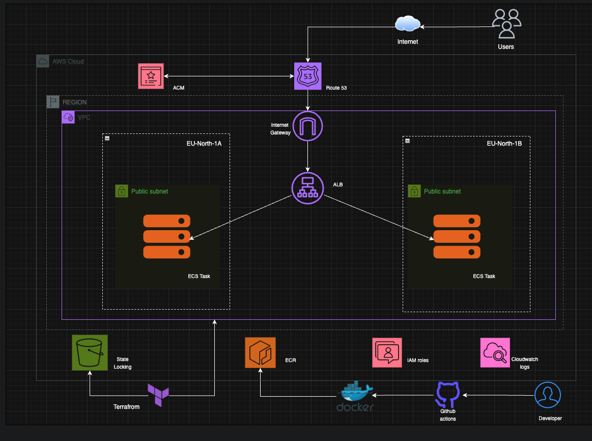

# Threat Composer on AWS

I built this as a production-style deployment of Threat Composer on AWS. The application is containerised with Docker and deployed to Amazon ECS Fargate behind an Application Load Balancer. I manage the infrastructure using Terraform modules and automate deployments through GitHub Actions.

I ship releases using ECS rolling deployments and store container images in Amazon ECR. I terminate TLS on the ALB with ACM and route traffic through Route 53 using a custom domain. Infrastructure is provisioned through reusable Terraform modules covering networking, load balancing, ECS, IAM, ACM, and DNS management.

For CI/CD, I use GitHub Actions with OpenID Connect (OIDC) authentication. Instead of storing long-lived AWS access keys as GitHub secrets, GitHub exchanges an OIDC token for temporary AWS credentials at runtime. This reduces the risk associated with credential leakage and follows AWS security best practices by using short-lived credentials that automatically expire after the workflow completes.

I also store Terraform state remotely in Amazon S3 with native state locking enabled. This provides a central source of truth for infrastructure management and prevents concurrent state modifications during Terraform operations.

# Architecture

When someone opens my app URL , Route 53 points the domain to my Application Load Balancer. The load balancer handles HTTPS using an ACM certificate and redirects HTTP traffic to HTTPS.

From the load balancer, traffic is forwarded to a target group connected to my ECS Fargate service. ECS runs the Threat Composer container using an image stored in Amazon ECR. The application listens on port 3000, and the ECS service keeps the desired task count running.

The ECS tasks write logs to CloudWatch Logs through the ECS task execution role. Security groups are used to control access between the load balancer and the ECS tasks, so application traffic only reaches the container through the ALB path.

Terraform manages the infrastructure using separate modules for VPC, ALB, ECS, IAM, ACM, and Route 53. Terraform state is stored remotely in Amazon S3 with native state locking enabled to provide a central source of truth and prevent concurrent infrastructure changes.

# High-level architecture

